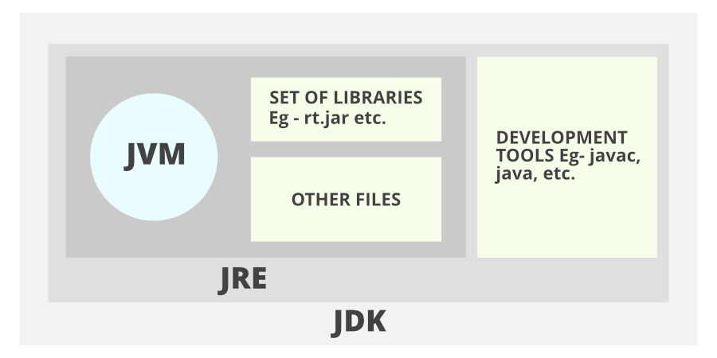

# Lecture 1

## Java

### Package

A package in Java is used to group related classes, it is managed by directory.

1. Java has some built-in packages and multiple packages together forms a **library**. 

Function > Class > Package > Library / Application

```java
import package.name.Class;   // Import a single class
import package.name.*;   // Import the whole package
```

We have a Animal Package
```
Animal
    |__ Cat.java
    |__ Dog.java
    |__ Greetings.java
Main.java
```


### Class Modifiers

There're 2 groups of modifiers

1. **Access Modifiers** - controls the access level
2. **Non-Access Modifiers** - do not control access level, but provides other functionality

```java
public class Main
```

For a class

| Modifier   | Description                                                  |
| ---------- | ------------------------------------------------------------ |
| default    | The class is only accessible by classes in the same package. |
| **public** | The class is accessible by any other class                   |

For Attributes


e.g
```java

class Dog {
    
    private int weight = 10;

    int getWeightKG() {
        return weight;
    }

    int getWeightG() {
        return weight * 100;
    }
}

Dog dog;

System.out.println(dog.weight)
System.out.println(dog.getWeightKG())
System.out.println(dog.getWeightG())
```

TODO: What are other modifiers?


### [Architecture of Java](https://docs.oracle.com/javase/tutorial/getStarted/intro/definition.html)



1. JDK: Java Development Kit
2. JRE: Java Runtime Environment
3. JVM: Java Virtual Machine


Architecture Layer

* JAVA -> JVM -> MAC/PC

* C++ -> MAC/PC

JAVA -> bytecodes (only JVM understands) -> 01 (Computer understands)
C++ -> 01


## Problem Assistance

### if_else branching
1. and: `&&`
    > equal to multiplication
1. or: `||`
    > equal to addition

```java
...
if ((a % 3 == 0 && a >= 53) || (a % 2 != 0 && a < 12)) {
    ...
    // Special case
} else if (a >= 4) {
    // Not special case
} else if (a % 2 == 0) {

}
...
```


### Switch

Switch can be a replacement for if-else in some programming languages. The difference is that without the keyword `break`, all branches that are compatible will be run, which is not the case for if-else.

```java
switch(expression) {
  case x:
    // code block
    break;
  case y:
    // code block
    break;
  default:
    // code block
}
```


```java
switch (a) {
    case a % 3 == 0 && a >= 53:
        system.out.println(a);
        break;
    case a % 2 != 0:
        system.out.println(a);
        break;
    default:
        .....  
}
```


### Arithmetics


## External


### [WSL](https://learn.microsoft.com/en-us/windows/wsl/install)

Windows Subsystem for Linux (WSL) is a feature of Windows that allows you to run a Linux environment on your Windows machine, without the need for a separate virtual machine or dual booting. WSL is designed to provide a seamless and productive experience for developers who want to use both Windows and Linux at the same time.


### Common commands

```bash
# update all the libraries
apt update
```

### Shell_Kernel

GUI: Graphical User Interface

CLI: Command Line Interface


Powershell

### [Git](https://git-scm.com)

Git is a free and open source distributed version control system designed to handle everything from small to very large projects with speed and efficiency.

#### Common Commands

1. Create a git directory

```bash
# . means current directory
git init .
```

2. Add the link current git directory to a remote repository.

```bash
git remote add <repo-name> <repo-url> 
```

3. Add current changes to Stage (record the current changes)

```bash
git add <file-name>

# add all changes in the current directory
git add .

# add all changes.
git add -A
```

4. Save all the changes to local repo

```bash
git commit
```

5. Push the current repo to remote


```bash
git push
```


### GitHub

Github 


##### Github SSH setup

SSH对应的是Secure Shell Protocol是一个用来远程安全连接另一个Shell的协议。另一个shell在这里就是指另一台电脑，我们已经讲过shell就是用来控制电脑的界面。举一个例子，当我们远程控制另一台电脑时，我们可以使用TeamViewer等类似应用使用用户图形界面（GUI）连接并控制另一台电脑。当我们用命令行来链接和控制另一台电脑时，我们使用的就是SSH。

类似登陆一个应用，SSH需要我们使用密码来验证自己。这个密码验证过程使用到的是[Public/Private Key](https://www.youtube.com/watch?v=_zyKvPvh808)。这是两个可以相互验证的密钥。

Github使用SSH来进行验证身份。因此我们需要生成一对 Public/Private keys. 并且将其中的public key 上传至Github。因此每次上传代码进行身份验证时，我们可以通过提供private key来验证自己。

首先生成Public/Private Key可以跟随[中文官方指导](https://docs.github.com/zh/authentication/connecting-to-github-with-ssh/generating-a-new-ssh-key-and-adding-it-to-the-ssh-agent?platform=linux)

1. 在WSL内输入以下来生成Public/Private key.

```bash
ssh-keygen -t ed25519 -C "your_email@example.com"
```

`ssh-keygen` 是用来生成一对public/private key的命令，这个命令是Linux自带的。`-t`是该命令的一个选项，用来选择加密的算法。因此`ed25519`是我们所选的算法。`-C` 是另一个选项，其后跟随的是注释。用来方便标注这个public/private key的作用。对密钥生成本身没有影响。

> 将上面`your_email@example.com`改成你自己的邮箱，主要包括引号。或将`-C "your_email@example.com"` 整段删除，仅保留 `ssh-keygen -t ed25519`


2. 当执行完第`1`的命令后会得到以下的结果。
   * 其中红色框内是Public/Private key默认存放的地址。推荐存在默认地址。因此直接按**回车**（Enter）即可。
   * 其中橙色框内是Public/Private key的密码。我们可以设置一个独立的密码来加密PrivateKey。但是在此我们不添加密码，因此再按**两次**回车。


3. SSH-Agent 是一个SSH的密码管理中介，如果我们对Private Key进行了密码加密，使用SSH-Agent可以让我们免去输入密码。更多的资料可以查看[GitHub官方的指导](https://docs.github.com/zh/authentication/connecting-to-github-with-ssh/generating-a-new-ssh-key-and-adding-it-to-the-ssh-agent?platform=linux#adding-your-ssh-key-to-the-ssh-agent)。在此因为我们第`2`步内，没有对Private Key进行密码加密，因此SSH-Agent可以忽略。

4. 查看Public Key。

```bash
cat /home/rosworkshop/.ssh/id_ed25519.pub
```

`cat`是Linux命令中查看文件的命令。在第`1`步的生成密钥的命令中，我们提到红色框内是密钥默认存放地址。在该地址下会分别生成`id_ed25519`文件包含Private Key，和`id_ed25519.pub`（注意后缀）文件包含Public Key。

> 将上面 `/home/rosworkshop/.ssh/id_ed25519.pub` 更改成你自己的地址。


5. 复制上面的到的Public Key 并根据[Github的指导](https://docs.github.com/zh/authentication/connecting-to-github-with-ssh/adding-a-new-ssh-key-to-your-github-account?platform=linux)将PublicKey添加到Github账号内。

#### Common Actions

1. Fork: To get a self-owned duplication of the current repository
2. Pull Request: A request to merge the new updates into the codebase