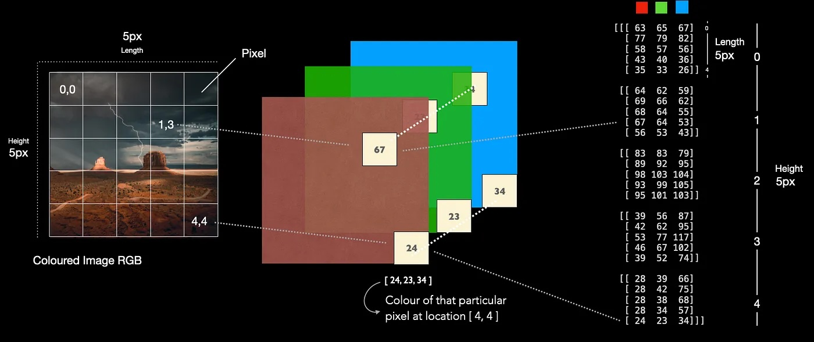
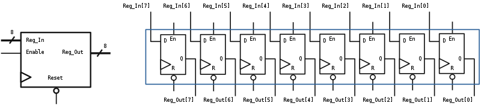

## Java

### Loops

In many cases, for example, counting the number of students in a room, we have to iterate through every student in order to know the final answer. This is also true in Computer Science, looping is a common action to be executed.


##### For loop

```java
for (int i = 0; i < 5; i++) {
  System.out.println(i);
}
System.out.prinln(i);
// increment a variable by 1.
// int i = 0;
// i = i + 1;
// i += 1;
// i++;
```

> `{}` will create a closure, and everything in the closure will be deleted once the closure is finished.

What is an image? An image is a 2 dimensional grid.



If we want to read the value of each pixel and potentially manipulate the values, how can we do it?


##### While Loop

Similar to For loop, while loop is also for iterations. However, unlike For loop we have a predefined rule, while loop depends on a condition. Imaging a hacking program that tries to modify a value in the memory indefinitely, we need a while true loop.

```java
while (condition) {
  // code block to be executed
}
```

A normal while loop only operate when the condition is met. Therefore, it's possible that the loop block is not run even once. However, sometimes we want the iteration to be run at least once, before checking the condition, we can use do while loop.

```java
do {
  // code block to be executed
}
while (condition);
```

##### Break & Continue

Sometimes, we may want to jump out of the loop earlier. Given an example of finding a student with a name `Eric`. We can iterate through all the students before saying we have found a student with `Eric`. But is it necessary? No, we can just stop iterating when we found a student called `Eric` right away.

```java
bool hasEric(String[] students) {
  for (int i = 0; i < 100; i++) {
    if (students[i] == "Eric") {
      break;
      // return true;
    };
  }
  return false;
}

String[] student = { "Bob", "Eric", "Alice" };
for (int idx = 0; idx < student.length; idx++) {
    System.out.println("I am " + student[idx]);
    if (student[idx] == "Eric") {
        System.out.println("We have an Eric");
        break;
    }
}

String[] student = { "Bob", "Eric", "Alice" };
for (int idx = 0; idx < student.length; idx++) {
    System.out.println("I am " + student[idx]);
    if (student[idx] == "Eric") {
        continue;
    }
    System.out.println("I got a candy");
}
```

`break` when we want to stop earlier. `continue` when we want to skip.

### Arrays

```java
String[] cars = {"Volvo", "BMW", "Ford", "Mazda"};
int[] nums = {1, 2, 3, 4, 5};
```

## Problem Assistance


## External


### Gates

* And Gates


* Or Gates


* Not Gates


* Xor Gates


#### Flip-Flop / Latch

A latch allows a state to be maintained until a reset signal is received. Thus we can store 1 bit on it.


Combining `N` latches we can form a register that is the lowest level storage in a CPU.

