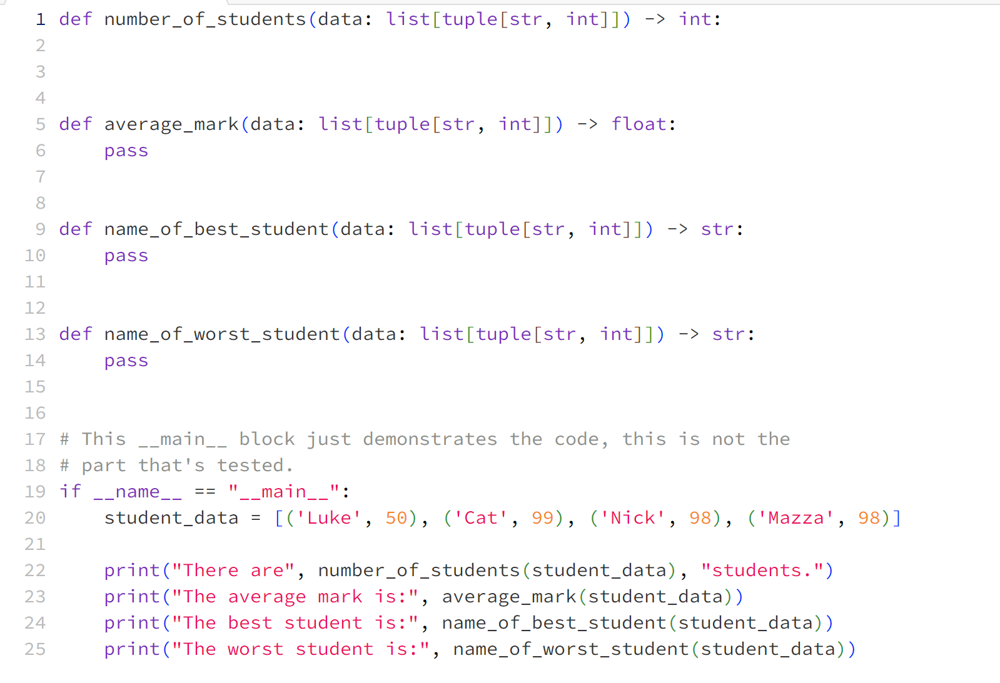

## Java

### POJO

POJO is not categorized by what it has to have, but instead what it has **NOT** to have.

NOT:

1. Extend any other class (not a child class of any other classes)
2. Can't implement any other interfaces.
3. No outside annotations.

> Meaning its a **simple** class without any dependencies to the outside world.

```java
// example of POJO
public class Cat {
    int age;
    String name;
}

// inheritance
public class Animal {
    void walk() {
        // ....
    }
}
public class Dog extends Animal {
}
public class Cat extends Animal {
}


// not pojo example 1
public class Cat extends Animal {
    int age;
    String name;
}

// not pojo example 2
public class Cat implements MakesNoise {
    int age;
    String name;
}

// not pojo example 3
@Entity
public class Cat {
    int age;
    String name;
}
```

Similar to POJO, there's another concept called **JavaBean** which is more strict.

NOT:

1. No-args constructor
2. Properties must be private
3. Public getters and setters
4. Must be serializable

```java
public class Cat {
    private int age;

    public Cat() {
        // constructor
    }

    public int getAge() {
        return this.age;
    }

    public setAge(int age_) {
        this.age = age_;
    }
}

public class Main {
    Cat cat = new Cat();
    // ERROR: cat.age
    cat.getAge();
}

// why getter/setter is important
public class KgToPound {
    private int weight;
    // times 1.5 when reading.
    public int getWeight() {
        return this.weight * 1.5;
    }
}

KgToPound kp = new KgToPound();
kp.weight = 10;
System.out.println(kp.weight);


public class Receipt {
    private int price;

    public int getPrice() {
        return this.price + "Thank you";
    }
}
```

#### [Memory Management in Java](https://www.youtube.com/watch?v=_GK3WoFFKUE)


```java
public class Cat {
    public void meow() {
        int x = 10;
        System.out.print("meow" + x);
    }
}
// heap memory
public class Main() {

    void temp(Cat cat_) {
        cat_.meow();
    }

    public static void main() {
        Cat cat = new Cat();

        temp(cat);

        cat.meow();
    }
}

```


| Parameter           | Stack Memory                                                                                                    | Heap Space                                                                                                                                                   |
| ------------------- | --------------------------------------------------------------------------------------------------------------- | ------------------------------------------------------------------------------------------------------------------------------------------------------------ |
| Application         | It stores items that have a very short life such as methods, variables, and reference variables of the objects. | It stores objects and Java Runtime Environment (JRE) classes.                                                                                                |
| Ordering            | It follows the LIFO order.                                                                                      | It does not follow any order because it is a dynamic memory allocation and does not have any fixed pattern for allocation and deallocation of memory blocks. |
| Flexibility         | It is not flexible because we cannot alter the allocated memory.                                                | It is flexible because we can alter the allocated memory.                                                                                                    |
| Efficiency          | It has faster access, allocation, and deallocation.                                                             | It has slower access, allocation, and deallocation.                                                                                                          |
| Visibility or Scope | The variables are visible only to the owner thread.                                                             | It is visible to all threads.                                                                                                                                |
| Generation of Space | When a thread is created, the operating system automatically allocates the stack.                               | To create the heap space for the application, the language first calls the operating system at run time.                                                     |
| Order of allocation | Memory allocation is continuous.                                                                                | Memory allocated in random order.                                                                                                                            |

#### [Garbage Collection](https://www.youtube.com/watch?v=Mlbyft_MFYM)

For a certain period of time, GC will activate to look for all heap variables without a reference and do a **mark** and **cleanup**.

This process is tedious and time consuming, since we have to look over all the heap variables. In order to make this process more efficient, the mark procedure also try to move the variables that lives through several rounds of GC to a different section called **Old Generation**. The checks for old gen is much less frequent to save time.


#### [Pass By Reference and Value](https://stackoverflow.com/questions/40480/is-java-pass-by-reference-or-pass-by-value#:~:text=Pass%2Dby%2Dvalue%20means%20that,always%20pass%2Dby%2Dvalue.)

**Java is strict pass by value.**


Let us assume that a function B() is called from another function A(). In this case A is called the “caller function” and B is called the “called function or callee function”

**Pass By Value**: Changes made to formal parameter do not get transmitted back to the caller. Any modifications to the formal parameter variable inside the called function or method affect only the separate storage location and will not be reflected in the actual parameter in the calling environment. This method is also called as call by value.


```java
public static void main(String[] args) {
    Dog aDog = new Dog("Max");
    Dog oldDog = aDog;

    // we pass the object to foo
    foo(aDog);
    // aDog variable is still pointing to the "Max" dog when foo(...) returns
    aDog.getName().equals("Max"); // true
    aDog.getName().equals("Fifi"); // false
    aDog == oldDog; // true
}

public static void foo(Dog d) {
    d.getName().equals("Max"); // true
    // change d inside of foo() to point to a new Dog instance "Fifi"
    d = new Dog("Fifi");
    d.getName().equals("Fifi"); // true
}


//############

Dog myDog = new Dog("Rover");
foo(myDog);

public void foo(Dog someDog) {
    someDog.setName("Max");     // AAA
    someDog = new Dog("Fifi");  // BBB
    someDog.setName("Rowlf");   // CCC
}
```


## Problem Assistance





## External