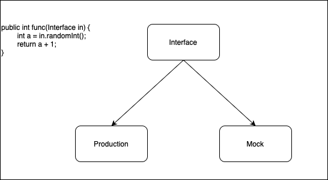

## Java


### Inheritance

Inheritance is useful for code reusability: reuse attributes and methods of an existing class when you create a new class.

```java
class Vehicle {
  protected String brand = "Ford";        // Vehicle attribute
  public void honk() {                    // Vehicle method
    System.out.println("Tuut, tuut!");
  }
}

class Car extends Vehicle {
  private String modelName = "Mustang";    // Car attribute
  public static void main(String[] args) {

    // Create a myCar object
    Car myCar = new Car();

    // Call the honk() method (from the Vehicle class) on the myCar object
    myCar.honk();

    // Display the value of the brand attribute (from the Vehicle class) and the value of the modelName from the Car class
    System.out.println(myCar.brand + " " + myCar.modelName);
  }
}
```

The `protected` modifier means this attribute is only available for subclasses, while not available for the outside world. If it was set to private, the Car class would not be able to access it.

> If you don't want other classes to inherit from a class, use the `final` keyword

### Polymorphism

Inheritance lets us inherit attributes and methods from another class. Polymorphism uses those methods to perform different tasks. This allows us to perform a single action **in different ways**.

```java
class Animal {
  public void animalSound() {
    System.out.println("The animal makes a sound");
  }
}

class Pig extends Animal {
  public void animalSound() {
    System.out.println("The pig says: wee wee");
  }
}

class Dog extends Animal {
  public void animalSound() {
    System.out.println("The dog says: bow wow");
  }
}

class Main {
  public static void main(String[] args) {
    Animal myAnimal = new Animal();  // Create a Animal object
    Animal myPig = new Pig();  // Create a Pig object
    Animal myDog = new Dog();  // Create a Dog object
    myAnimal.animalSound();
    myPig.animalSound();
    myDog.animalSound();
  }
}
```



## Problem Assistance


## External