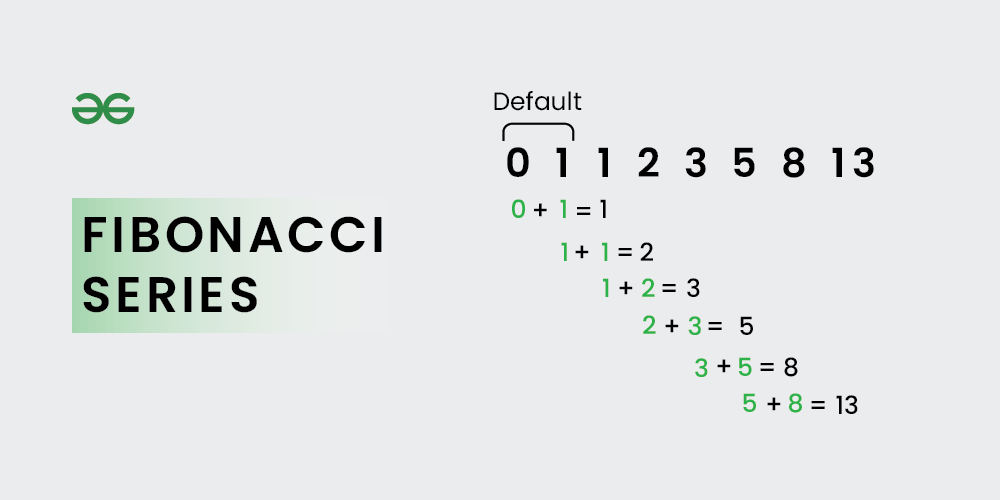

## Java

### Recursion

Recursion is the technique of making a function call itself. This technique provides a way to break complicated problems down into simple problems which are easier to solve.

```java
public class Main {
  public static void main(String[] args) {
    int result = sum(10);
    System.out.println(result);
  }
  public static int sum(int k) {
    if (k > 0) {
      return k + sum(k - 1);
    } else {
      return 0;
    }
  }
}
```

### Fibonacci Series

The Fibonacci series is the sequence where each number is the sum of the previous two numbers of the sequence. The first two numbers of the Fibonacci series are 0 and 1 and are used to generate the Fibonacci series.



```
Fn = Fn-1 + Fn-2

where F0 = 0; F1 = 1
```


### HashMap


In the ArrayList chapter, you learned that Arrays store items as an ordered collection, and you have to access them with an index number (int type). A HashMap however, store items in **"key/value"** pairs, and you can access them by an index of another type (e.g. a String).

One object is used as a key (index) to another object (value). It can store different types: String keys and Integer values, or the same type, like: String keys and String values:


```java
// Import the HashMap class
import java.util.HashMap;

public class Main {
  public static void main(String[] args) {
    // Create a HashMap object called capitalCities
    HashMap<String, String> capitalCities = new HashMap<String, String>();

    // Add keys and values (Country, City)
    capitalCities.put("England", "London");
    capitalCities.put("Germany", "Berlin");
    capitalCities.put("Norway", "Oslo");
    capitalCities.put("USA", "Washington DC");
    System.out.println(capitalCities);


    // Print keys
    for (String i : capitalCities.keySet()) {
      System.out.println(i);
    }
  }
}

```


## Problem Assistance


## External