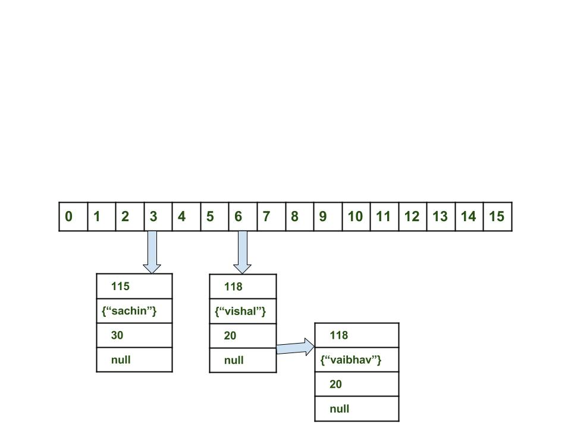

## Java

### HashMap internal

Buckets: A bucket is **an element** of the HashMap array. It is used to store nodes. Two or more nodes can have the same bucket. In that case, a link list structure is used to connect the nodes.

> A single bucket can have more than one node, it depends on the hashCode() method. The better your hashCode() method is, the better your buckets will be utilized. 

一个Array的元素并不是一个Key-Value pair。而相反是一个Bucket，他实际上就是一个LinkedList。

When a new element is inserted, `map.put(new Key("vishal"), 20);`

1. the first step is to calculate where is should be stored in the array. 

```java
index = hashCode(key) % n
```

2. Create a node object as:

```java
{
  int hash = 118

  // {"vishal"} is not a string but 
  // an object of class Key
  Key key = {"vishal"}

  Integer value = 20
  Node next = null
}
```

3. Place this object at index `idx`, **if no other object is presented there**.

> 只有当`array[idx]`位置上没有其他元素占用时，当前的node才可以直接存入。

4. If there's other object already in that position.Follow the linked list, and check if keys are the same. If they are the same, means the current key is inserted already and the new node should replace its value.

> 如果当前位置已经被占用时，就需要沿着LinkedList往下看，如果遇到相同的key的节点时，就代表当前key已经被存入过，我们需要将新的值与之替换。

5. Otherwise append the new node at the end.




### Iterator

Here are example codes to iterate all elements in ArrayList and Hashmap

```java
ArrayList<String> arrayList = new ArrayList<>();
// Add some elements to the ArrayList

for (int i = 0; i < arrayList.size(); i++) {
    String element = arrayList.get(i);
    // Perform operations with each element
    System.out.println(element);
}
```

```java
HashMap<String, Integer> hashMap = new HashMap<>();
// Add some key-value pairs to the HashMap

for (String key : hashMap.keySet()) {
    Integer value = hashMap.get(key);
    // Perform operations with key-value pair
    System.out.println("Key: " + key + ", Value: " + value);
}
```

When can see they have very different structure for iteration. Therefore, the idea of iterator is a pointer that gives an **uniform interface** for iterating a collection of data.

> 当我们看到它们在迭代上具有非常不同的结构时，迭代器的概念应运而生。因此，迭代器是一个指针，为迭代数据集合提供了统一的接口。


```java
import java.util.ArrayList;
import java.util.Iterator;

public class Main {
  public static void main(String[] args) {
    ArrayList<Integer> numbers = new ArrayList<Integer>();
    numbers.add(12);
    numbers.add(8);
    numbers.add(2);
    numbers.add(23);
    Iterator<Integer> it = numbers.iterator();
    while(it.hasNext()) {
      Integer i = it.next();
      if(i < 10) {
        it.remove();
      }
    }
    System.out.println(numbers);
  }
}
```


### Exception

When an error occurs, Java will normally **stop** and generate an error message. The technical term for this is: **Java will throw an exception (throw an error).**


In order to keep the program running, we have to manually handle the exception.

```java
public class Main {
  public static void main(String[ ] args) {
    try {
      int[] myNumbers = {1, 2, 3};
      System.out.println(myNumbers[10]);
    } catch (Exception e) {
      System.out.println("Something went wrong.");
    }
  }
}
```

The `finally` statement lets you execute code, after `try...catch`, regardless of the result:


## Problem Assistance


## External